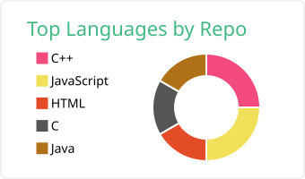
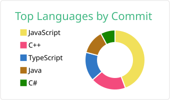
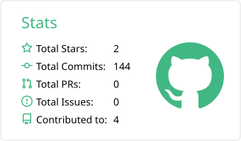
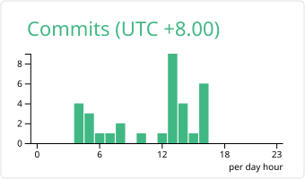

<h1> Hey! Nice to see you.</h1>

 

<!-- Languages donut + pentagon (radar) side by side -->

 

<!-- All-time stats: Total Stars / Commits / PRs / Issues since account creation -->

 

<!-- Bottom card -->

