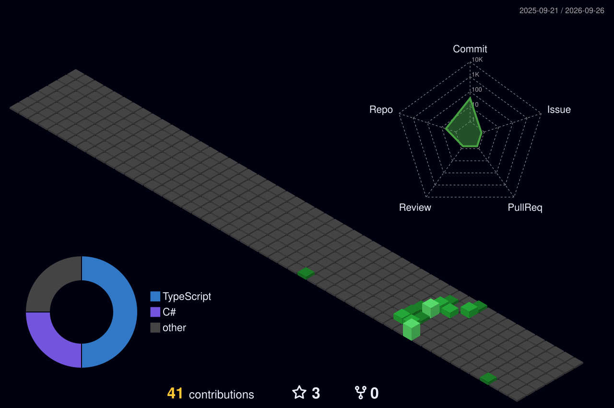

# 👋 Hey! Nice to see you.

<!--
NOTE: exact SVG filenames/paths depend on what each Action actually outputs on first run.
After running the workflow once, check the Actions log or the repo file tree and adjust
the  paths above to match if they differ.
-->

